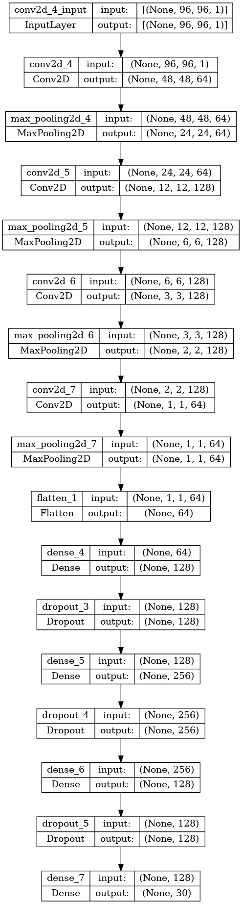
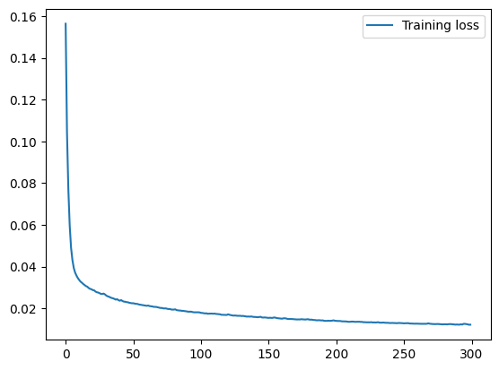
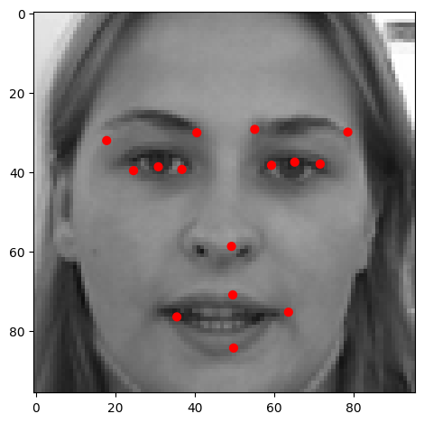
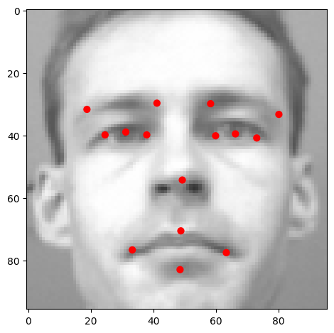
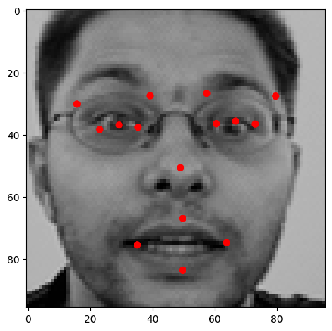

# 👨 Face Filters 📷
This app lets you use filters on your face after deteceting your facial keypoints.

# Data
The data that the model has trained on is the [facial keypoints detection dataset](https://www.kaggle.com/c/facial-keypoints-detection/data).

The data should be downloaded, and extracted inside the ```facial-keypoints-detection``` folder. Or the folder where the ```DATA_PATH``` variable points to in the code.
# Usage
Install dependencies :
```
pip install -r requirements.txt
```
Run the app for direct usage : 
```
python app.py
```
To train again from scratch : 
```
python train.py
```
# Convolutional Neural Network
The CNN that has been used has the following architecture : 



It uses : 
* ```Conv2D``` layers,
* ```MaxPooling2D``` layers,
* ```Relu``` activation functions, 
* Some ```Dropout``` for regularization.

# Training
Training has been done over **300 epochs**. With a **batch size of 100**, and an **Adam optimizer**. The total training time is approximately **5 minutes**.

Final training results : 
* Training loss : **0.0121**



# Test images anchor points
<p float="left">



</p>

**References** : https://github.com/agrawal-rohit/opencv-facial-filters